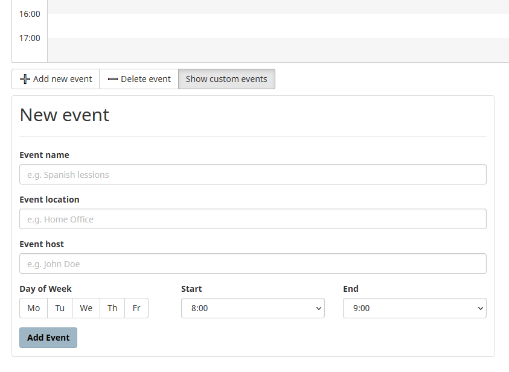
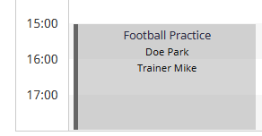
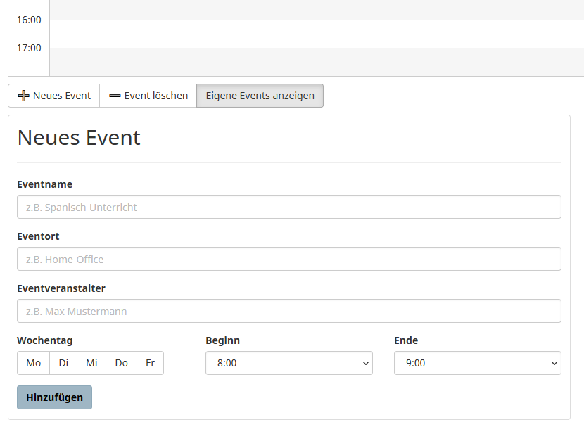
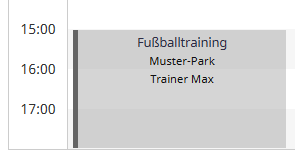

# MosesPlan

Extension for Firefox and Chromium browsers

*Deutsche Version weiter unten.*

## English version

**Allows adding custom events to "Moses", a class- and exam-management website used by the Technical University Berlin.
Fully supports both English and German based on the Moses language setting.**

When installed, the extension will display the possibility to add custom events below your Moses calendar:

These events are preserved between reloads and even between sessions. They display exactly like native events created by
Moses itself.

You can also toggle the display of custom events, and delete events you no longer need.

### FAQ

* **Does this save my events somewhere external?** No. This will make privacy-oriented people happy, and
  integration-oriented people sad. The truth is, this is a nice tool to plan your schedule, and I don't want to get
  caught up in either a privacy disaster nor do I want to host any single point of failure.
* **Can I trust this extension to not steal my [login/data/grades]?** Sometimes people will assure you "of course, we
  have the highest standards when it comes to ..." and so on. That's buzzwords. Fact is: My name is right there. The
  code is right here. Why would I be so stupid to use Git, of all things, to commit university fraud? Really now.
* **I have discovered a bug!** Please open a GitHub issue. I do not accept Pull Requests for licensing reasons.

## Deutsche Version

**Ermöglicht das Hinzufügen von benutzerdefinierten Events zu "Moses", einer von der Technischen Universität Berlin
verwendeten Website zur Verwaltung von Lehrveranstaltungen und Prüfungen. Unterstützt Englisch und Deutsch je nach
Moses-Spracheinstellung.**

Nach der Installation zeigt dir die Erweiterung die Möglichkeit an, eigene Events unter deinem Moses-Kalender
hinzuzufügen:

Die hinzugefügten Events bleiben zwischen Sitzungen erhalten. Sie werden genau wie von Moses selbst erzeugte Ereignisse
dargestellt:

Du kannst auch die Anzeige von eigenen Events ein- und ausschalten, und nicht mehr benötigte Ereignisse löschen.

### FAQ

* **Werden meine Events irgendwo extern gespeichert?** Nein. Das wird Privatsphäre-orientierte Menschen glücklich
  machen, und integrationsorientierte Menschen traurig. Die Wahrheit ist, dass es nur ein nettes Werkzeug ist, um deinen
  Stundenplan zu ordnen, und ich möchte weder in eine Datenschutzkatastrophe verwickelt werden, noch möchte ich einen
  einzelnen verantwortlichen Server hosten.
* **Kann ich darauf vertrauen, dass diese Extension meine [Daten/Noten/Ergebnisse] nicht klaut?** Oft steht hier sowas wie: "Natürlich haben wir die höchsten Standards, wenn es um ..." und so weiter. Das sind Buzzwords. Tatsache ist: Mein Name steht genau hier. Der Code steht genau hier. Warum sollte ich so dumm sein, ausgerechnet Git zu benutzen, um Universitätsbetrug zu begehen? Jetzt mal ehrlich.
* **Ich hab einen Bug gefunden!** Bitte schreib ein GitHub-Issue. Ich akzeptiere aus lizenzrechtlichen Gründen keine Pull-Requests.

## Known Issues

* Events in Delete modal are sorted by Added Time. This means it can be hard to find an issue.

## License

This program is free software: you can redistribute it and/or modify it under the terms of the GNU General Public License as published by the Free Software Foundation, either version 3 of the License, or (at your option) any later version.

This program is distributed in the hope that it will be useful, but WITHOUT ANY WARRANTY; without even the implied warranty of MERCHANTABILITY or FITNESS FOR A PARTICULAR PURPOSE. See the GNU General Public License for more details.

You should have received a copy of the GNU General Public License along with this program. If not, see <https://www.gnu.org/licenses/>.